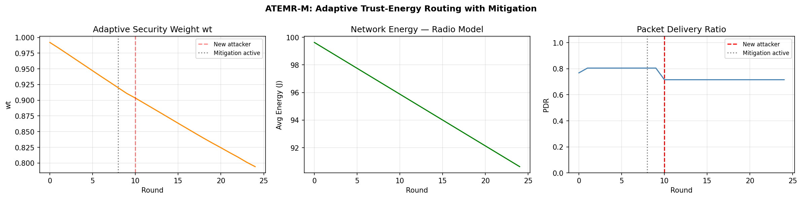

# ATEMR-M: Adaptive Trust-Energy Multi-objective Routing with Mitigation

A Python simulation of a secure routing protocol for Wireless Sensor Networks (WSNs) that dynamically balances security and energy efficiency based on real-time network state, without any ground-truth knowledge of which nodes are malicious.

## The Problem

WSN routing protocols face a fundamental tension:

- Energy-first routing maximises network lifetime but is vulnerable to malicious nodes that drop or manipulate packets
- Trust-first routing avoids attackers but wastes battery routing around low-energy nodes

Most protocols treat these as separate concerns with fixed weights. ATEMR-M solves both simultaneously through a single adaptive scoring function that shifts priorities in real time.

## Core Idea: Adaptive Weights

The central contribution is a weight formula that responds to current network conditions:

    w_t = AttackLevel / (AttackLevel + EnergyDrainRate)
    w_e = 1 - w_t

| Scenario | w_t | w_e | Behaviour |
|---|---|---|---|
| High attack, full energy | high | low | Prioritise security |
| No attack, depleted energy | low | high | Prioritise energy |
| Startup | ~0.5 | ~0.5 | Balanced |
| Late simulation + attack | ~0.5 | ~0.5 | Balanced |

Routing score per edge:

    Score_ij = w_t x Trust_ij + w_e x (ResidualEnergy_j / MaxEnergy)

## How Trust is Computed

Trust is built purely from packet-level observations — no ground-truth flags are read.

Direct Trust (DT):

    DT_ij = 0.5 x (packets_forwarded / packets_sent)
          + 0.3 x (acks_received / packets_sent)
          + 0.2 x (1 / (1 + avg_delay))

Each component detects a different attack:
- Forwarding ratio: black hole attacks
- ACK ratio: selective forwarding
- Delay score: delay injection

Indirect Trust (IT) aggregates neighbour opinions, auto-downweighting malicious recommenders.

Temporal update with adaptive lambda:

    T_ij(t) = lambda x T_ij(t-1) + (1-lambda) x (0.7 x DT + 0.3 x IT)

Lambda drops 0.5 to 0.3 when a trusted node suddenly behaves badly, speeding up on-off attack detection.

## Mitigation

| S_j range | Status | Action |
|---|---|---|
| S_j < 0.30 | Normal | Routes freely |
| 0.30 to 0.45 | Suspicious | Monitored |
| S_j >= 0.45 | Malicious | Isolation vote cast |

Isolation requires votes from more than 1/3 of actual neighbours. False positive recovery uses a 3-round probation window. Malicious nodes are permanently blocked — their DT ceiling of ~0.14 is below the reinstatement floor of 0.30.

## Results

Simulation output (20 nodes, 25 rounds, seed=42):

- Nodes 1 and 2 isolated at round 9 — both confirmed malicious (7/7 and 8/8 neighbour votes)
- Node 14 turned malicious at round 11, isolated in the same round (4/7 votes)
- PDR held at 0.805 through rounds 1-10 despite 2 active malicious nodes
- PDR settled at 0.716 after round 11 attacker isolated — routing avoids all 3 malicious nodes
- Network energy drained only 9.4% over 25 rounds (100J to 90.6J), vs ~93% in naive all-pairs model
- Adaptive security weight w_t started at 0.992 and decreased linearly as energy drained, showing the protocol correctly shifting priority from security toward energy conservation as the network aged

## Network Model

- 20 nodes in a 500 x 500 m field
- TX_RANGE = 200 m, avg 5.7 neighbours per node
- First-order radio energy model (Heinzelman et al.)
- 3 malicious nodes: 2 from round 1, 1 new at round 11
- Malicious nodes forward 0-15% of packets, honest nodes 90-100%

## Quick Start

    git clone https://github.com/NidhilRS/ATERM-M.git
    cd ATERM-M
    pip install -r requirements.txt
    python ATEMR-M.py

Set VERBOSE = True in the script for detailed per-round output.

## Key Design Decisions

Why lambda = 0.5 not 0.7: At 0.7 a newly malicious node takes ~8 rounds to reach the isolation threshold, longer than the simulation window. At 0.5 it takes 3-4 rounds.

Why eigenvector fusion was removed: It propagated malicious nodes' low trust onto honest neighbours, causing all-node isolation cascades. Indirect trust with snapshot protection already handles this correctly.

Why mitigation starts at round 9: Trust initialises at 0.5, giving suspicion of 0.5 which already exceeds the threshold. By round 9 honest nodes reach T~0.85 and malicious nodes T~0.20.

## Parameters

| Parameter | Value | Description |
|---|---|---|
| NUM_NODES | 20 | Network size |
| ROUNDS | 25 | Simulation duration |
| TX_RANGE | 200 m | Transmission range |
| INITIAL_ENERGY | 100 J | Per-node energy budget |
| LAMBDA_NORMAL | 0.5 | Trust memory (normal) |
| LAMBDA_ATTACK | 0.3 | Trust memory (anomaly) |
| MITIGATION_START_ROUND | 8 | Round isolation activates |
| PROBATION_WINDOW | 3 | Good rounds to reinstate |

## Known Limitations

- 20 nodes is below publication-grade. Needs 20-50 random seeds with confidence intervals.
- Greedy path selection is a simplification of full multi-objective optimisation.
- Baselines share the same mitigation as ATEMR-M, making comparison less strict.

## References

- Heinzelman et al. (2000). Energy-efficient communication protocol for wireless microsensor networks. HICSS.
- Blaze et al. (1996). Decentralized trust management. IEEE S&P.
